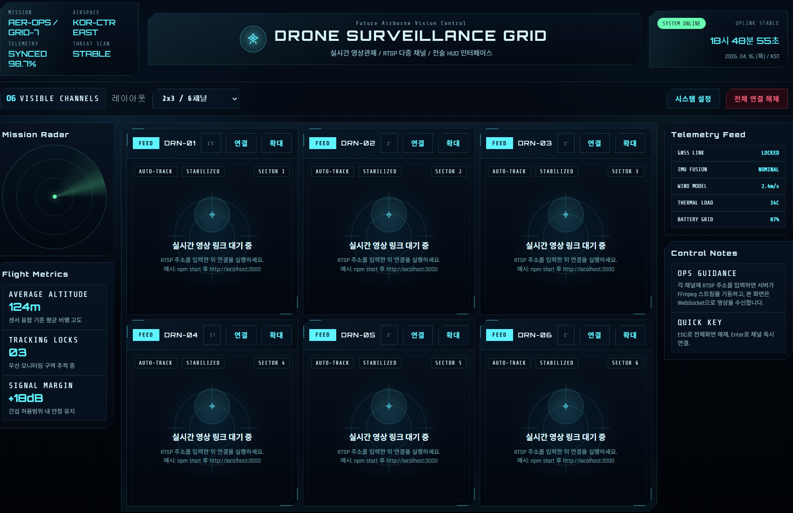

# RTSP Relay Viewer

브라우저 기반 실시간 드론 영상 관제 시스템. RTSP/RTMP/HTTP 스트림을 FFmpeg로 트랜스코딩하여 WebSocket을 통해 브라우저에 저지연으로 중계합니다.


## 스크린샷



## 주요 기능

- **다중 채널 모니터링** - 1x1 / 2x2 / 2x3 / 3x3 레이아웃 (최대 9채널 동시 수신)
- **프로토콜 지원** - RTSP, RTMP, HTTP 스트림 입력
- **저지연 중계** - FFmpeg MPEG1 트랜스코딩 + WebSocket + JSMpeg 캔버스 렌더링
- **자동 재연결** - FFmpeg 프로세스 종료 시 최대 30회 자동 재시도, 클라이언트 Watchdog
- **실시간 메타정보** - 코덱, 해상도, FPS, 비트레이트, 업타임 표시
- **전체화면** - 개별 채널 확대/복귀
- **전술 HUD UI** - 군사 스타일 관제 인터페이스

## 아키텍처

```
[RTSP/RTMP 소스] → [FFmpeg (MPEG1 변환)] → [Express + WebSocket 서버] → [브라우저 JSMpeg 캔버스]
```

## 사전 요구사항

- **Node.js** 18 이상
- **FFmpeg** - 프로젝트 폴더에 `ffmpeg.exe` 포함 또는 시스템 PATH에 등록

## 설치 및 실행

```bash
# 의존성 설치
npm install

# 서버 실행
npm start
```

서버가 시작되면 브라우저에서 `http://localhost:3000` 에 접속합니다.

## 사용법

1. 브라우저에서 관제 화면 접속
2. 각 채널 패널의 입력창에 스트림 URL 입력 (예: `rtsp://192.168.0.100:8554/stream`)
3. **연결** 버튼 클릭 또는 `Enter` 키
4. 실시간 영상 수신 확인

### 단축키

| 키 | 동작 |
|---|---|
| `Enter` | 채널 즉시 연결 |
| `ESC` | 전체화면 해제 |

## API

| Method | Endpoint | 설명 |
|--------|----------|------|
| `POST` | `/api/stream/start` | 스트림 시작 (`{ id, url }`) |
| `POST` | `/api/stream/stop` | 스트림 중지 (`{ id }`) |
| `POST` | `/api/stream/stop-all` | 전체 스트림 중지 |
| `GET` | `/api/stream/status` | 전체 채널 상태 조회 |

## 프로젝트 구조

```
├── server.js            # Express + WebSocket 릴레이 서버
├── drone-viewer.html    # 프론트엔드 관제 UI
├── jsmpeg.min.js        # MPEG1 브라우저 디코더
├── ffmpeg.exe           # FFmpeg 바이너리
└── package.json
```

## 설정

브라우저 UI의 **시스템 설정** 버튼에서 조정 가능:

- 릴레이 서버 주소
- FFmpeg 비디오 비트레이트
- 출력 해상도 (640x360 ~ 1920x1080)

## License

MIT
